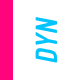

# danielyarzanavarro.me
<a name="readme-top"></a>


<!-- PROJECT LOGO -->
<br />
<div align="center">
  <a href="https://github.com/dyarzanavarro/danielyarzanavarro.me">
    
  </a>

  <h3 align="center">Showcasing with NUXT3 and Tailwind</h3>

  <p align="center">
    Here's my custom built portfolio
    <br />
     <br />
    <a href="https://www.danielyn.ch/">View Live Site</a>
    ·
    <a href="https://github.com/dyarzanavarro/danielyarzanavarro.me/issues">Report Bug / Request something new</a>
    ·
  </p>
</div>


<!-- TABLE OF CONTENTS -->
<details>
  <summary>Table of Contents</summary>
  <ol>
    <li>
      <a href="#about-the-project">About The Project</a>
      <ul>
        <li><a href="#built-with">Built With</a></li>
      </ul>
    </li>
    <li>
      <a href="#getting-started">Getting Started</a>
      <ul>
        <li><a href="#prerequisites">Prerequisites</a></li>
        <li><a href="#installation">Installation</a></li>
      </ul>
    </li>
    <li><a href="#usage">Usage</a></li>
    <li><a href="#roadmap">Roadmap</a></li>
    <li><a href="#contributing">Contributing</a></li>
    <li><a href="#license">License</a></li>
    <li><a href="#contact">Contact</a></li>
    <li><a href="#acknowledgments">Acknowledgments</a></li>
  </ol>
</details>


<!-- ABOUT THE PROJECT -->
## About The Project

I like to build stuff in my free time and an easy way to keep up to date with my favorite frameworks I tend to build and rebuild Portfolios. (Who doesn't? 😊)
This current iteration is built with Nuxt3, Tailwind and TS. Please click around and explore if you feel like it; shoot me a message or raise an issue if you're bored!


<p align="right">(<a href="#readme-top">back to top</a>)</p>


### Built With

This section should list any major frameworks/libraries used to bootstrap your project. Leave any add-ons/plugins for the acknowledgements section. Here are a few examples.

* [![Nuxt][Nuxt.js]][https://nuxtjs.org/]
* [![Vue][Vue.js]][https://vuejs.org/]
* [![Tailwind][Tailwindcss.com]][https://tailwindcss.com/]


<p align="right">(<a href="#readme-top">back to top</a>)</p>


<!-- GETTING STARTED -->
## Getting Started

This is an example of how you may give instructions on setting up your project locally.
To get a local copy up and running follow these simple example steps.

### Prerequisites

This is an example of how to list things you need to use the software and how to install them.
* npm
  ```sh
  npm install npm@latest -g
  ```

### Installation

_Below is an example of how you can instruct your audience on installing and setting up your app. This template doesn't rely on any external dependencies or services._

1. Clone the repo
   ```sh
   git clone https://github.com/dyarzanavarro/danielyarzanavarro.me.git
   ```
2. Install NPM packages

    -npm install

3. serve with hot reload at localhost:3000

    -npm run dev
4. build for production and launch server

    -npm run build


# generate static project
$ npm run generate

<p align="right">(<a href="#readme-top">back to top</a>)</p>


<!-- CONTRIBUTING -->
## Contributing

Contributions are what make the open source community such an amazing place to learn, inspire, and create. Any contributions you make are **greatly appreciated**.
Please feel free to do it here too!
If you have a suggestion that would make this better, please fork the repo and create a pull request. You can also simply open an issue with the tag "enhancement".
Don't forget to give the project a star! Thanks again!

1. Fork the Project
2. Create your Feature Branch (`git checkout -b feature/AmazingFeature`)
3. Commit your Changes (`git commit -m 'Add some AmazingFeature'`)
4. Push to the Branch (`git push origin feature/AmazingFeature`)
5. Open a Pull Request

<p align="right">(<a href="#readme-top">back to top</a>)</p>


<!-- LICENSE -->
## License

Distributed under the MIT License.

<p align="right">(<a href="#readme-top">back to top</a>)</p>


<!-- CONTACT -->
## Contact

[@dyarnav](https://twitter.com/dyarnav) - danielyarza1@gmail.com

Project Link: [https://github.com/dyarzanavarro/danielyarzanavarro.me](https://github.com/dyarzanavarro/danielyarzanavarro.me)

<p align="right">(<a href="#readme-top">back to top</a>)</p>

